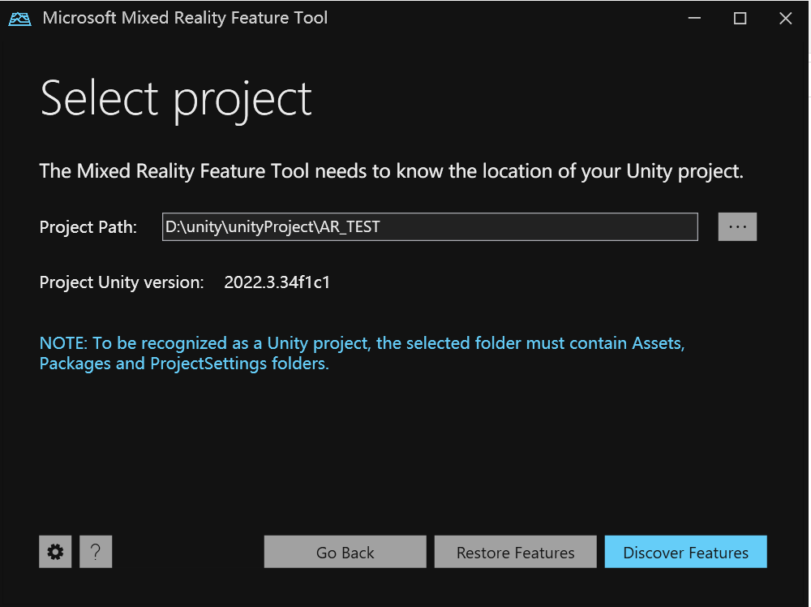
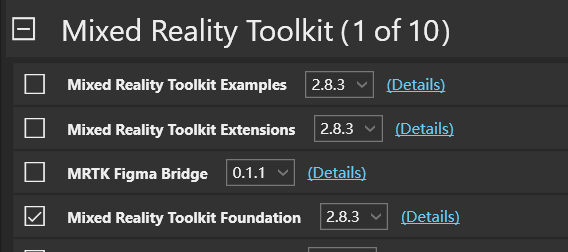
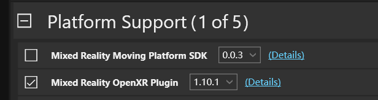
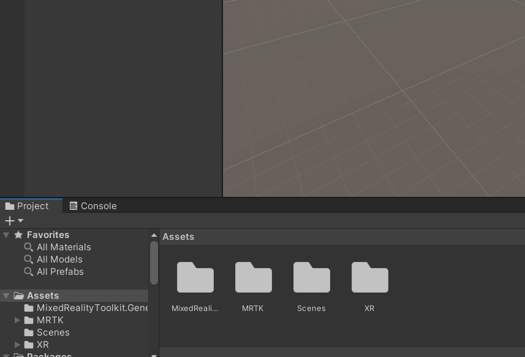

## 库
unity 开发库XR Interaction Toolkit
Mixed Reality OpenXR Plugin
AR Foundation
Open XR标准

### API
[微软MRTK的API参考](https://learn.microsoft.com/zh-cn/dotnet/api/microsoft.mixedreality.toolkit?view=mixed-reality-toolkit-unity-2020-dotnet-2.8.0)

- TrackedHandJoint API可以获取手部的不同点位

## 1.环境：
#### 在unity的build构建项目
- 如果安装-编辑器只有打开文件资源管理器和从hub里删除两个选项的话，是因为编辑器从外部导入，无法安装模块
- 安装UWP(Universal Window Plaform)模块
- 勾选 Development Build，并设置 Build Type 为 D3D Project。
- 在 Player Settings 中，配置应用程序的 Company Name, Product Name，并确保 XR Settings 中启用了 Virtual Reality Supported 并选择了 Windows Mixed Reality。
- 在XR plugin setting 选择HoloLens相关

- 新建一个目录build, 点击build开始构建
#### 在vstudio里打开build文件里的sln文件

### 用microsoft Mixed Reality Feature Tool 安装MRKT工具包
- [下载连接](https://www.microsoft.com/en-us/download/details.aspx?id=102778)
- 选择项目时，在unity项目目录下，如图中的AR_TEST目录下，随意创建一个文件，在选择该文件来打开就可以自动检测当前目录下的文件

- 在discover feature里选择如下两个组件


- 最后点击import和approve。在打开unity项目里，可以开到package多了MRTK


## 2.1 unity项目文件结构
asserts
Library

不需要手动修改。该文件夹会被自动生成。
>   
### 2.2 组件
nScence 场景:相当于一个对象，如D模型，ui元素，脚本
### 2.3 inspector 即右边所见的视图
像transformzhe'y等都是组件。组件有c#文件的，通过添加组件的方式将编写的c#代码加入到项目里

### 2.4 材质
Albedo: 设置基本颜色或纹理。
Metallic: 调整金属感（通常为 0）。
Smoothness: 控制表面光滑度（较高的值会产生更多高光反射）。
Transparency: 在 Rendering Mode 选择 Transparent，以控制透明度。
Emission: 启用 Emission，设置发光颜色和强度。
Normal Map: 添加法线贴图以增加表面细节。


## 3. sense模板选择
### 3D
1. 3D Object（3D 对象）
用于在场景中创建和管理 3D 几何体。
Cube: 创建一个立方体对象。常用于基础 3D 建模和碰撞检测。
Sphere: 创建一个球体对象。用于表示球形物体。
Capsule: 创建一个胶囊体对象。常用于角色碰撞体。
Cylinder: 创建一个圆柱体对象。用于表示柱状物体。
Plane: 创建一个平面对象。用于地板、天花板或墙壁。
Quad: 创建一个四边形对象。用于 2D 纹理贴图。
Text - TextMeshPro: 使用 TextMeshPro 显示 3D 文本，支持高级文本排版和渲染。
2. 2D Object（2D 对象）
用于创建和管理 2D 场景中的对象。

Sprite: 创建一个 2D 精灵。用于显示图像和精灵动画。
Sprite Mask: 用于遮罩精灵，使得部分精灵可见或不可见。
Tilemap: 创建一个瓦片地图，用于 2D 网格化的游戏场景。
Polygon: 创建一个自定义形状的多边形对象。
Text - TextMeshPro: 使用 TextMeshPro 显示 2D 文本，支持高级文本排版和渲染。
3. UI（用户界面）
用于创建和管理用户界面元素。

Canvas: UI 的根容器，所有 UI 元素都必须作为 Canvas 的子元素。
Text: 创建一个文本对象，用于显示简单的文本。
Button: 创建一个按钮对象，支持点击事件。
Image: 创建一个图像对象，用于显示图片。
Raw Image: 显示原始的纹理图像，支持更多格式。
Slider: 创建一个滑动条，用于调整值。
Scrollbar: 创建一个滚动条，用于在长内容中滚动。
Dropdown: 创建一个下拉菜单，用于选择项。
Toggle: 创建一个开关，用于二元状态（开/关）。
Input Field: 创建一个输入字段，用于用户输入文本。
Panel: 用于容纳和布局 UI 元素的容器。
Scroll View: 创建一个滚动视图，用于在有限空间内显示大量内容。
4. Light（光源）
用于在场景中创建和管理光照效果。

Directional Light: 创建一个方向光源，类似于太阳光照。
Point Light: 创建一个点光源，从一个点向四周发散光线。
Spot Light: 创建一个聚光灯，从一个点沿锥形区域发射光线。
Area Light: 创建一个区域光源，从一个面板发射光线（主要用于静态全局照明）。
5. Audio（音频）
用于在场景中创建和管理音频效果。

Audio Source: 创建一个音频源，用于播放音效。
Audio Reverb Zone: 创建一个混响区域，模拟环境的声音反射效果。
6. Effects（特效）
用于在场景中创建和管理各种视觉特效。

Particle System: 创建一个粒子系统，用于模拟火焰、烟雾、爆炸等特效。
Trail: 创建一个轨迹渲染器，用于显示对象移动时的轨迹。
Line: 创建一个线条渲染器，用于显示直线或曲线。
7. Video（视频）
用于在场景中创建和管理视频播放。

Video Player: 创建一个视频播放器对象，用于播放视频文件。
8. Camera（摄像机）
用于在场景中创建和管理视图。

Camera: 创建一个摄像机对象，捕捉场景中的图像和动画。
9. Empty Object（空对象）
Empty: 创建一个空的 GameObject，用于组织层次结构或附加组件。
10. XR（扩展现实）
用于创建扩展现实（AR/VR）中的对象。

AR Camera: 特定于 AR 场景的摄像机。
AR Session Origin: 控制 AR 场景中的对象位置。
AR Session: 管理 AR 会话。
11. Mixed Reality Toolkit（MRTK）
用于在 HoloLens 和其他混合现实设备中开发应用。

Mixed Reality Toolkit: 提供常用的混合现实功能配置，如输入系统、手势、空间感知。
Boundary System: 配置空间边界。
Spatial Mesh Observer: 管理空间网格，用于环境感知。
Teleport System: 配置空间传送功能。
12. Other（其他）


### 3.1 TMP(textMaxpro)
- 组件RectTransform, 控制文本的位置和缩放
[Rect ransform官方文档](https://docs.unity3d.com/Packages/com.unity.ugui@2.0/manual/class-RectTransform.html)
```
Position 控制组件位置
Rotation 控制组件旋转
Anchor 主要用于固定 UI 元素或 3D 对象的位置
Scale 
```
- 组件Mesh Renderer 组件用于渲染网格

