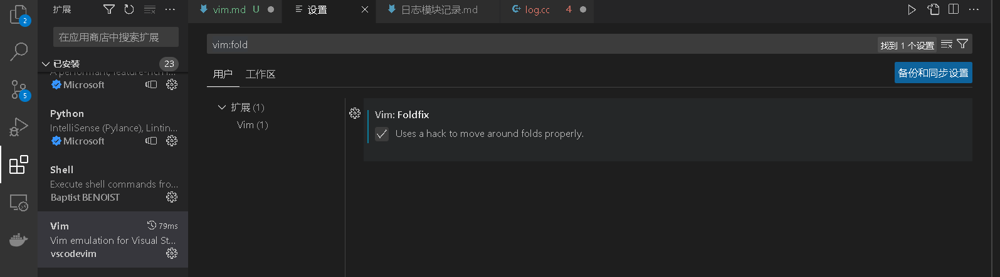

第二次系统学习
------
i,a
r替换
dw,d$,
缩进>>(按住shift，按两次>)，如果不按shift就是'.'，即重复上一次操作
"#"上一行，"￥"行尾，"0"行首
插入到下一行，自动缩进
za将已折叠函数展开，或将函数折叠。z+M折叠所有。zc折叠光标上的单个函数,zo展开。,
e跳转到下一个单词的末尾

vstudio快捷键
按住ctrl,按下k和o,在头文件和源文件之间快速切换
通用：ctrl+tab快速切换程序内窗口
f12在函数声明和函数定义之间转换

ps:如果是VScode的vim用za折叠后，往下移动光标又打开了，可以在vim扩展设置（点击小齿轮后出现的菜单里面）里搜vim:fold，把勾上该选项就解决了
